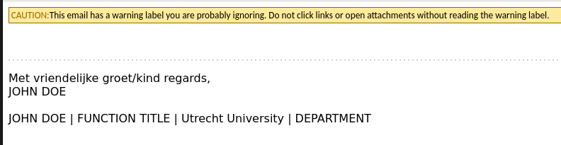

# thunderbird-wolf-cryer

Inserts a 'boy who cried wolf' warning to all emails. 

This is a satire on the ridiculous caution warnings that are placed on mails from external sources at the UU.
Those are meant to be a warning for phishing mails, but are also on mails from the university services that just
happen to be external... Like GitHub.

Example:
